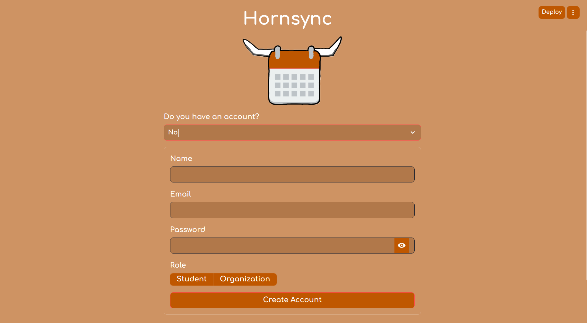
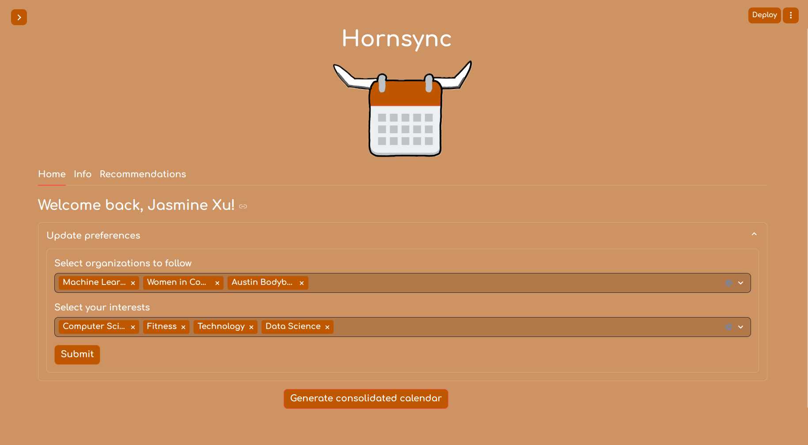
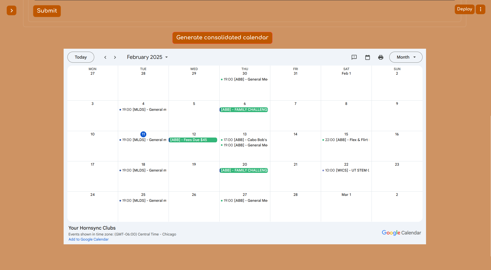
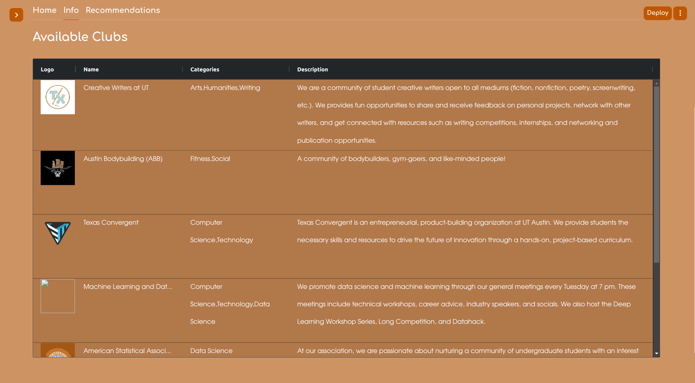
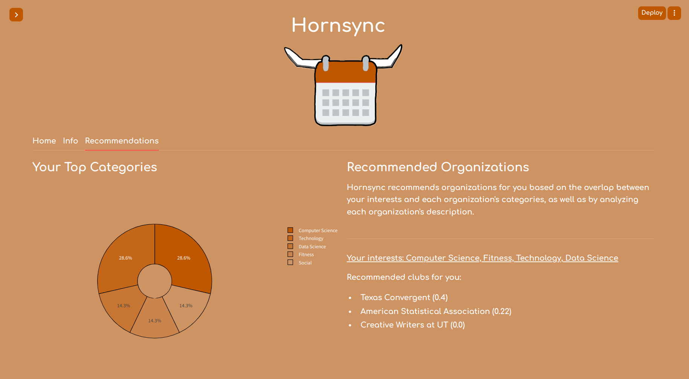
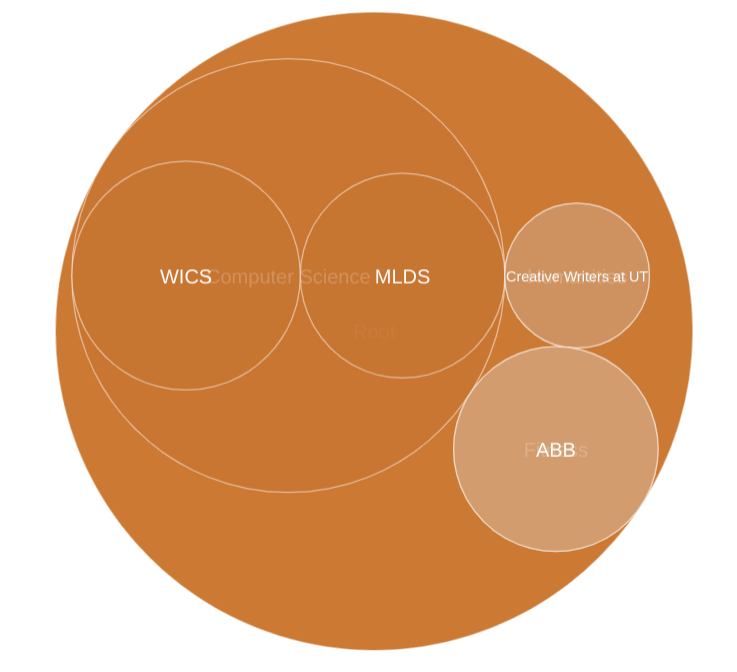

# Hornsync

### Intro

This was my project submission for [WICS Hacks 2025](https://docs.google.com/presentation/d/161yaQLD1PE5aiPMBHRwf0SrRimzXRl19yhlTOGvUMZI/edit?usp=sharing). I worked in a solo team and ended up winning the prize category I'd been aiming for (Best UT Hack)! My [final presentation](FINAL_PRESENTATION.pdf) has further details on how I created Hornsync.

### Demo

#### Log In Screen

#### Home Screen - Update Preferences & Generate Consolidated Calendar

#### Info Screen

#### Recommendations Screen

---

### TODO
* Improving the recommendation system: 
  * Currently, I am using a composite score that looks at the overlap of a student's categories of interest with categories relevant to each org, as well as the cosine similarity score between vectors of the student's interests and each org's description. This does not really take into account actual *semantics* - it is more raw text matching, which naturally isn't ideal, but for the purpose of the hackathon, was more computationally efficient. 
* Integration with Hornslink:
  * Hornslink is where information for all UT orgs is stored. However, it is a huge site with a vast amount of information, and little guidance for students when it comes to selecting orgs that they are genuinely interested in. I think Hornslink could benefit greatly from a proper recommendation system.
* More stats!
  * Maybe it's just me, but I would love to see stats of how I distribute my time across my clubs - e.g., what percentage of my club activities were spent with MLDS, ABB, WICS, etc. 
* How can we highlight less popular clubs?
  * There is a huge disparity between huge and smaller clubs here at UT. My own experience as president of MLDS has allowed me to interact with fellow engineering org presidents, and several have voiced difficulties associated with managing a smaller club with less publicity (and hence less corporate or department funding). These clubs do amazing things and should be promoted to students who are interested in what they do, but might not have heard of them before.
    * Using TF-IDF in the recommendation system may be helpful for this bc it takes into account term rarity, but again, not semantics. So maybe I'd have to do something where I generate a bunch of semantic synonyms for each student interest before computing the score.
  * Not entirely a solution but more just bc I enjoy visualizations - I tried to make a little bubble chart sort of thing for the hackathon but didn't get it done in time. But it would contain all clubs within certain categories and their bubble size would be based on their member count. This would still more strongly highlight already-big clubs, but at least it would display all orgs in a nicer way.

    

* How can we foster more collaboration between clubs?
  * Collaborating with other clubs can allow for them to collectively put on bigger events. Additionally, it can help with exposure for smaller clubs.